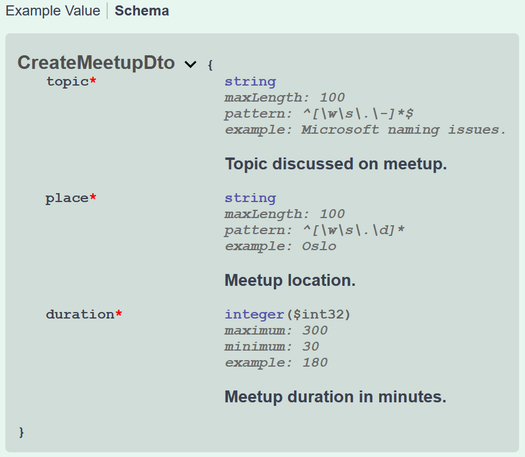

# Валидация


## Содержание

1. [Валидация в ASP](#Валидация-в-ASP)
2. [Валидирование DTO](#Валидирование-DTO)
3. [Результат](#Результат)


## Валидация в ASP

Как и OAS, валидацию не нужно писать вручную: в NuGet уже есть библиотеки, предоставляющие удобные инструменты для
автоматического валидирования объектов. Вот самые популярные:
1. [Annotation validation](#https://www.nuget.org/packages/System.ComponentModel.Annotations)
2. [Fluent validation](#https://www.nuget.org/packages/FluentValidation).
В шаблоне, который мы использовали для создания проекта, уже настроена интеграция с `Annotation validation`, так что
воспользуемся ею.


## Валидирование DTO

Мы будем валидировать только входные данные (нет необходимости валидировать выходные данные, т.к. мы их сами
сформировали и можем быть уверены в их валидности). На данный момент из входных данных у нас есть только route-параметры
(id, передаваемый через url) и DTO. Валидацию id нам осуществлять не нужно, т.к. об этом мы уже позаботились, указав тип
id в url-шаблоне (`/meetups/{id:guid}`). А вот DTO нам нужно валидировать.

Рассмотрим `CreateMeetupDto`:
```csharp
public class CreateMeetupDto
{
    public string Topic { get; set; }
    public string Place { get; set; }
    public int Duration { get; set; }
}
```

У нас есть 3 поля:
1. [Topic](#Валидация-поля-Topic)
2. [Place](#Валидация-поля-Place)
3. [Duration](#Валидация-поля-Duration).

> **Note**: Валидация `UpdateMeetupDto` будет точно такая же.

### Валидация поля Topic

Рассмотрим поле `string Topic`. Митап не может быть без темы, так что поле должно быть помечено как обязательное. Также
тема митапа не может быть слишком длинной, так что можно ограничить её, например в 100 символов. Также мы не хотим
видеть какие-либо специальные символы в названии темы митапа, так что можно разрешить только стандартный текст + символы
пунктуации. Итого имеем следующие правила валидации:
```csharp
[Required]
[MaxLength(100)]
[RegularExpression(@"^[\w\s\.-–—]*$")]
public string Topic { get; set; }
```

> **Note**: Для ограничения использования символов, я использовал regex `^[\w\s\.-–—]*$`. Вы можете ознакомиться с regex
в [это статье](https://docs.microsoft.com/en-us/dotnet/standard/base-types/regular-expression-language-quick-reference).

### Валидация поля Place

Рассмотрим поле `string Place`. Аналогично теме, место проведения митапа также является его обязательным свойством.
Ограничение длины можно оставить тем же, а вот паттерн нужно изменить так, что бы он допускал использование цифр (что бы
было возможно указать точный адрес). В итое получим:
```csharp
[Required]
[MaxLength(100)]
[RegularExpression(@"^[\w\s\.\d]*")]
public string Place { get; set; }
```

### Валидация поля Duration

Рассмотрим поле `int Duration`. Это поле также является обязательным, однако, недостаточно просто пометить его атрибутом
`[Required]`. Это связано с тем, как ASP обрабатывает json: если в DTO поле имеет `не-nullable` тип, а в json'е это поле
не передано, то в качестве значения будет автоматически использовано `default`-значения для типа поля (в случае `int`
это `0`). Т.е. если мы передадим митап без указания его продолжительности, то автоматически будет указана нулевая
продолжительность. Нас это не устраивает, так что мы также добавим `[Range(min, max)]` атрибут и укажем рамки валидных
значений от `30` до `300` минут (`0.5` - `5` часов соответственно). В итоге получим:
```csharp
[Required]
[Range(30, 300)]
public int Duration { get; set; }
```


## Результат

Поскольку `Annotation validation` уже настроена, нам осталось только запустить приложение и убедиться в том, что всё
работает как требуется.

При попытке создать митап со следующими параметрами:
```json
{
  "topic": "<code />",
  "place": "Invalid address!",
  "duration": 0
}
```
Мы получаем сообщение об ошибке:
```json
{
  "type": "https://tools.ietf.org/html/rfc7231#section-6.5.1",
  "title": "One or more validation errors occurred.",
  "status": 400,
  "traceId": "00-3799693787de9a2a7e6d4db4ab2c7dbe-d7b8543525a7b4c6-00",
  "errors": {
    "Place": [
      "The field Place must match the regular expression '^[\\w\\s\\.\\d]*'."
    ],
    "Topic": [
      "The field Topic must match the regular expression '^[\\w\\s\\.\\-]*$'."
    ],
    "Duration": [
      "The field Duration must be between 30 and 300."
    ]
  }
}
```

Также можно обратить внимание, что Swashbuckle имеет интеграцию с валидацией:

